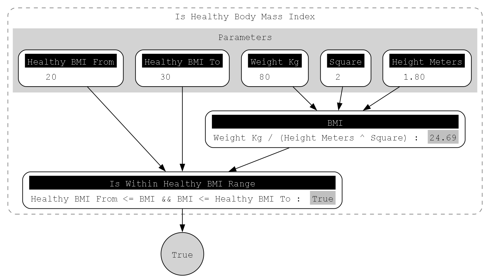

[](https://sonarcloud.io/summary/new_code?id=jitt-team_fluent-calculations-primitives)
[](https://sonarcloud.io/summary/new_code?id=jitt-team_fluent-calculations-primitives)

[](https://sonarcloud.io/summary/new_code?id=jitt-team_fluent-calculations-primitives)
[](https://sonarcloud.io/summary/new_code?id=jitt-team_fluent-calculations-primitives)


[](https://opensource.org/license/gpl-3-0/)

# Fluent Calculations

Fluent Calculations is a set of libraries for building traceable calculations and logic.

> One of the more powerful ways to make a program readable is to break the calculations up into intermediate values that are held in variables with meaningful names. - _Robert C. Martin, Clean Code, A Handbook of Agile Craftsmanship_


## Disclaimers

The project is and experiment, authors are exploring a technical viability and the value proposition.

## Burning need

Having worked on many line of business applications authors have observed a common 
difficuty in having a common understading withing team and users when dealing with of non-trivial business logic or calculations. 
Validating the correctness of financial calculations like taxes as an example involves a lot of effort on analyst or tester side. 
Pinpointing problems from just the final result is rather challanging, thus often developer resort to manual debugging of the test cases.
TDD falls short of communicating more complex test cases to business people as it relies on quite granular decompostion. 
Splitting up some algorithms is not always a good option too, due to loss of the original conciseness. 
Troubleshooting calculations happening in a production environment is impossible without deploying 
some manual logging that makes code noisy and less readable.

## Value proposition

Same amount of code, save thousands of hours in debugging.

## Features

- Number and Boolean datatypes are supported,
- Seamlessly use C# math and logic operators,
- Build isolated calculation components,
- Close to no boilerplate code,
- Generate DOT graph output of your calculations.


## Get Started

Fluent.Calculations can be installed using the Nuget package manager or the `dotnet` CLI.

```
dotnet add package Fluent.Calculations.Primitives
```

## Documentation

- [Project Website](https://fcp-project.jitt.me/)
- [Class Library Documentation](https://fcp-api-browser.jitt.me/)


## Usage/Examples

Below is as hypothetical BMI calculation.

```c#
public class IsHealthyBodyMassIndexCalculation : EvaluationScope<Condition>
{
    Number
        WeightKg = Number.Of(80),
        HeightMeters = Number.Of(1.80m),
        Square = Number.Of(2);

    Number
        HealthyBMIFrom = Number.Of(20),
        HealthyBMITo = Number.Of(30);

    Number BMI => Evaluate(() => WeightKg / (HeightMeters ^ Square));

    Condition IsWithinHealthyBMIRange => Evaluate(() => HealthyBMIFrom <= BMI && BMI <= HealthyBMITo);

    public override Condition Return() => IsWithinHealthyBMIRange;
}

Condition isHealthyBMI = new IsHealthyBodyMassIndexCalculation().ToResult();
```

Calculation result can be visualized using [Graphviz](https://graphviz.org/).




## Roadmap & TODOs
- Explore ways to intorduce concept of units.
- Expand a list of supported operations and math functions.
- Explore ways to optimize lambda expression compilation.
- Explore a ways to reuse existing calculations and attempt to benefit from :
-- cached compiled expressions,
-- cached evaluation results,
-- partiall execution depending on changed parameters.
- Explore thread-safety aspects.
 
## License

[GNU General Public License v3.0](https://github.com/jitt-team/fluent-calculations-primitives/blob/2ada80ea405e5ce6198ef1a8973dc23a83bc20c1/LICENSE)


## Authors

- [@edgars-pivovarenoks](https://www.github.com/edgars-pivovarenoks)
- [@artur-karbone](https://www.github.com/arturkarbone)

## 🚀 About The Team
We are bunch of .NET practitioners allways looking for ways to make code great.

