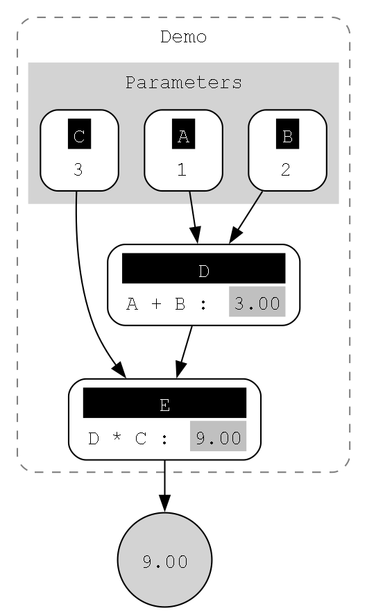

[](https://sonarcloud.io/summary/new_code?id=jitt-team_fluent-calculations-primitives)
[](https://sonarcloud.io/summary/new_code?id=jitt-team_fluent-calculations-primitives)

[](https://sonarcloud.io/summary/new_code?id=jitt-team_fluent-calculations-primitives)
[](https://sonarcloud.io/summary/new_code?id=jitt-team_fluent-calculations-primitives)


[](https://opensource.org/license/gpl-3-0/)

# Fluent Calculations

> One of the more powerful ways to make a program readable is to break the calculations up into intermediate values that are held in variables with meaningful names. - _Robert C. Martin, Clean Code, A Handbook of Agile Craftsmanship_

<div align="justify">
By following this principle together wit Fluent Calculations library we gain an ability to write readable calculations as well as get insights at runtime.
</div>

## Motivation
<div align="justify">
<p>
Having worked on many line of business and some finance  applications authors have observed a common difficulty of understating and communicating non-trivial business logic or calculations. 
</p><p>
Validating the correctness of financial calculations, like tax calculations for example, involves a lot of effort on analyst or tester side. For a developer pinpointing problems from just the final result is challenging, thus often we resort to manual debugging.
</p><p>
TDD falls short of communicating more complex test cases to business people as it relies on quite granular decomposition. Splitting up some algorithms is not always a good option too, due to loss of the original conciseness. Troubleshooting calculations happening in a production environment is impossible without deploying some manual logging that makes code noisy and less readable.
</p>
<p>
This project attempts to provide a clean way to get an "X-ray" of calculations or business logic.
</p>
</div>

## The Goal

Spend minutes of programming to save hours of debugging and testing.

## Features

- Number (Decimal) and Condition (Boolean) datatype are supported,
- Seamlessly use C# math and logic operators,
- Build isolated calculation components,
- Close to no boilerplate code,
- Transform calculation tree as Json,
- Generate DOT graph output of your calculations,
- Visualize DOT graph calculations with Graphwiz.


## Get Started

Fluent.Calculations can be installed using the Nuget package manager or the `dotnet` CLI.

```
dotnet add package Fluent.Calculations.Primitives
```

## Documentation

- [Project Website](https://fcp-project.jitt.me/)
- [Class Library Documentation](https://fcp-api-browser.jitt.me/)


## Usage/Examples
Basic demo calculation:

```c#
public class Demo : EvaluationScope<Number>
{
    Number
        A = Number.Of(1),
        B = Number.Of(2),
        C = Number.Of(3);

    Number D => Evaluate(() => A + B);

    Number E => Evaluate(() => D * C);

    public override Number Return() => E;
}

Number result = new Demo().ToResult();
```

The `result` value can be : 
- Serialized to [JSON](https://www.json.org/json-en.html) (example: [fluent-calculation-demo.json](../assets/example/fluent-calculation-demo.json)),
- Converted to [DOT Language](https://graphviz.org/doc/info/lang.html) (example:  [fluent-calculations-demo.dot](../assets/example/fluent-calculations-demo.dot)),
- Rendered using [DOT rendering programs and utilities](https://graphviz.org/doc/info/command.html).



## Challenges
- Explore ways to introduce concept of units (Meters, Kilograms, etc.).
- Expand a list of supported operations and math functions.
- Explore ways to optimize lambda expression compilation.
- Explore a ways to reuse existing calculations and attempt to benefit from :
   - Cache compiled expressions,
   - Cache evaluation results,
   - Partial execution depending on changed parameters.
- Explore thread-safety aspects.
 
## License

[GNU General Public License v3.0](https://github.com/jitt-team/fluent-calculations-primitives/blob/2ada80ea405e5ce6198ef1a8973dc23a83bc20c1/LICENSE)


## Authors

- [@edgars-pivovarenoks](https://www.github.com/edgars-pivovarenoks)
- [@artur-karbone](https://www.github.com/arturkarbone)

## 🚀 About The Team
We are bunch of .NET practitioners always looking for ways to make code great.

